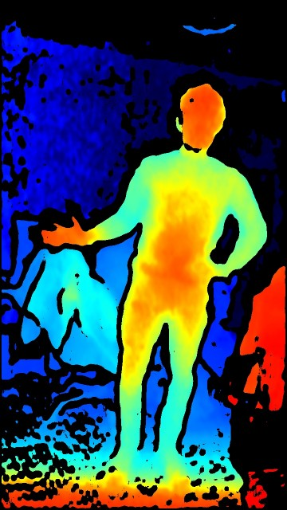
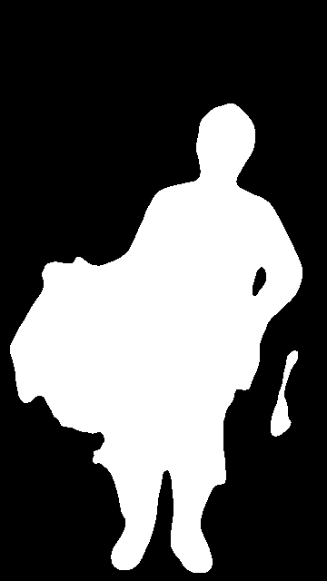
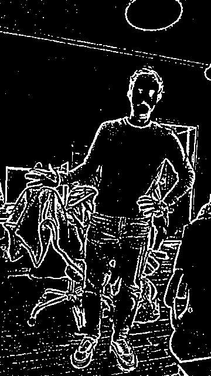
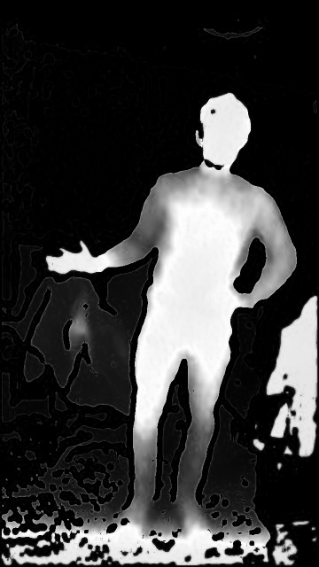
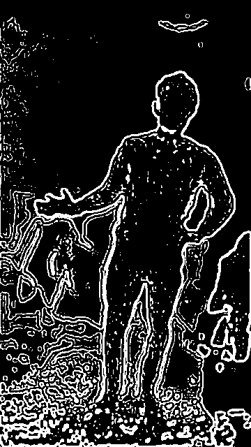
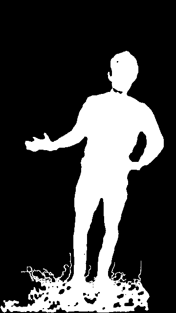
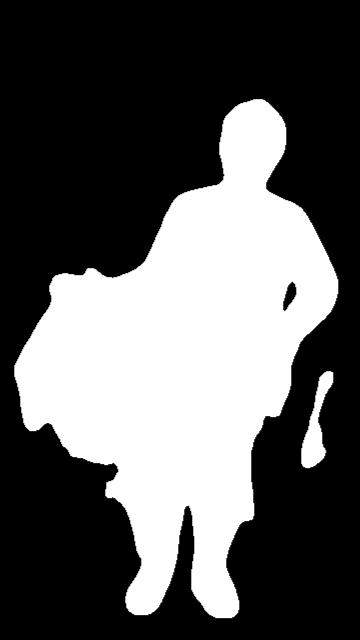
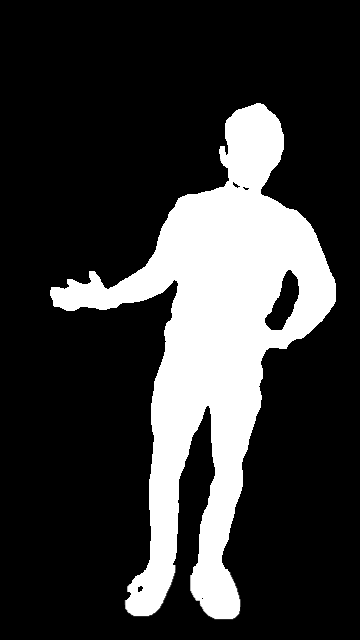

# ImageAlign
## Aligns 2D/3D images without using camera parameters

Given a color image taken with a normal camera (left figure) and a depth-map image taken with a stereo IR system (right figure), we develop a method that filters out the pixels of the depth-map image that corresponds to the human body.

### Methodology in brief

In order to filter out the pixels in the depth-map I decided to do the following: 

1)	Implement a sematic segmentation neural network to extract the human silhouette from the camera image

2)	Isolate the human body in the depth-map

3)	Align the silhouettes of the camera image and of the depth-map.

4)	Use the camera silhouette as a mask to isolate all the pixels in the depth map that correspond to the human figure.

The procedure has been subdivided into steps for clarity reasons.

Before you start you must dowmload the pretrained weights from https://www.dropbox.com/s/7rni1tzyjmdkiup/PSPnet.pth?dl=0 and save them in the "weights" folder.

### Detailed procedure
*Semantic segmentation*. The first step of the whole procedure is to feed the colored camera image to the neural network in order to obtain the human silhouette. This is achieved by running

  python inference.py --config config.json --model weights\PSPnet.pth --images image_cam –output images

After this step we obtain the following image .

At this point, however, the silhouette image and the depth image cannot be directly overlaid because they are not aligned.

*Image alignment*. The second step is to align the silhouette and the depth image. This can be done by using the intrinsic and extrinsic parameters of the cameras. However,  it is easier to use an automatic image-based procedure. More precisely, one can use the OpenCV  cv2.findTransformECC function that takes two images as input and calculates the transformation matrix to align them, and the cv2.warp function to align one image to the other. 
Unfortunately, the images in their original form cannot be precisely aligned because they are too different, so one can extract their contours and use these to calculate the alignment matrix.

This result can be obtained by running:  python 1_gradient.py
Thereafter we can run:  python 2_align.py  to produce a new aligned silhouette image.

  
  
  
  

*Object selection*. Unterestingly the depth system produces images where objects have a clear dark contour (i.e. pixels with values close to zero). This can be used at our advantage to extract objects from the depth map.

In order to know which object in the depth map corresponds to a human, one can calculate the center of the human silhouette and use this “seed” to perform a connected component identification on the depth map.

This can be obtained by running:  python 3_extract.py

  
  

  
*Intersection*. After we finally obtain the two “clean” images from the colored picture and the depth map, we need to intersect them to find which pixels in the depth map are actually part of the human figure. To do this we simply perform an AND operation between the two images.
This can be achieved by running:  python 4_intersect.py

  
  
  

  
*Evaluation*. To evaluate the results one can calculate the IOU (Intersection Over Union) factor with respect to the provided ground truth image. This is a commonly used method to evaluate the accuracy of segmentation algorithms given a (binary) reference result (Jaccard, New Phytologist 1912).

This measure can be obtained by running:   python 5_evaluate.py

In our specific case I obtain an IOU of 0.933, which compared to typical segmentation results seems to be quite good.

The neural network utilized here was the PSPNet, i.e. the "Pyramid Scene Parsing Network" (Zhao et al. CVPR 2017). This network exploits the capability of global context information by different region-based context aggregation through a pyramid pooling module together with a pyramid scene parsing mechanism.
It is based on the following project: https://github.com/yassouali/pytorch-segmentation
